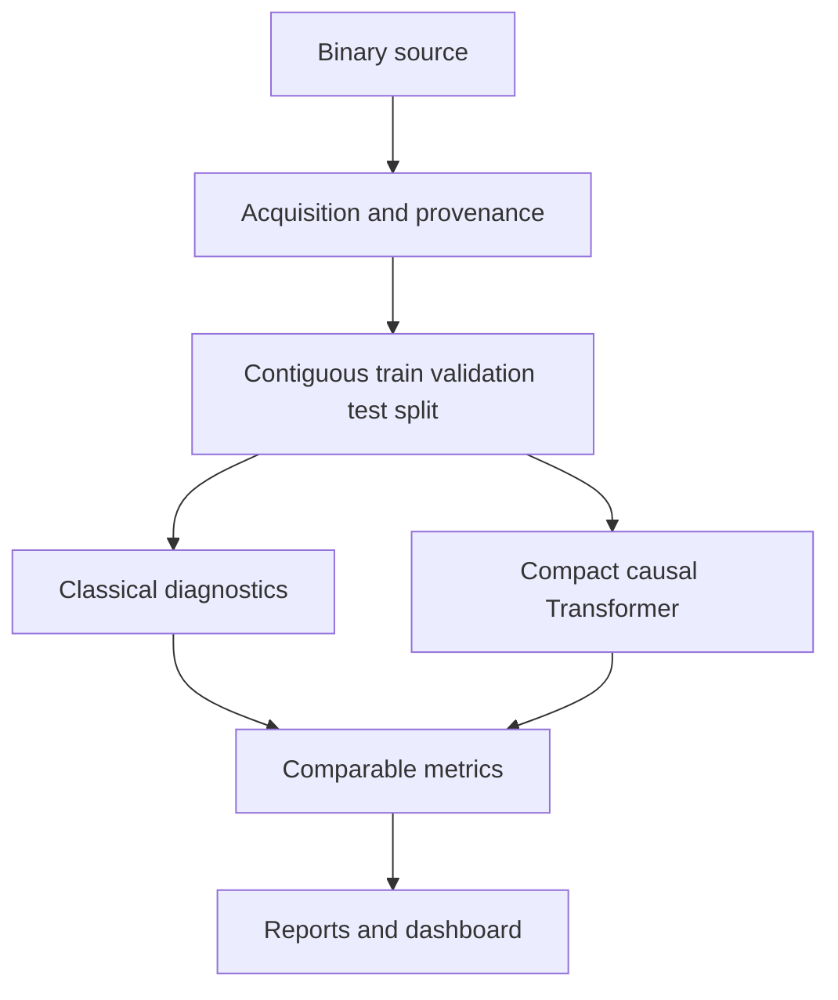

# RandomnessTransformerLab

Research prototype for **ML-based analysis of binary randomness sources** using a compact causal Transformer together with classical statistical, entropy, and compression-based indicators.

The project predicts the next bit or next block in a sequence and compares learned predictability with classical baselines. It is intended for research and portfolio experimentation, not as a replacement for official randomness-certification suites.

> **Important:** This repository does not implement an official NIST SP 800-22 or SP 800-90B compliance workflow. The included statistical checks are research diagnostics only.

## Real-data validation

The project was validated on **1,024,000 bits collected from 2,000 NIST Randomness Beacon 2.0 pulses** and compared with a controlled first-order Markov source using the same next-bit prediction pipeline.

### Validation results

| Source | Test Accuracy | Balanced Accuracy | ROC-AUC | Cross-Entropy (bits/bit) | Majority Baseline |
|---|---:|---:|---:|---:|---:|
| NIST Randomness Beacon 2.0 | **50.04%** | **50.00%** | **0.5004** | **1.0000** | **50.04%** |
| Controlled Markov source | **72.00%** | **72.00%** | **0.7206** | **0.8556** | **50.06%** |

The Transformer remained at chance-level on the real NIST Beacon sequence while clearly detecting temporal structure in the controlled Markov source. This contrast is the main validation result: the same model did not produce artificial predictability on the real beacon stream, but it did exploit known dependence in a weak source.

Additional Markov metrics:

- Perplexity: **1.8095**
- Brier score: **0.4033**
- Mean max probability: **0.7125**
- Predictive min-entropy proxy: **0.4891 bits/bit**
- Held-out samples: **153,472**

Additional NIST Beacon metrics:

- Perplexity: **2.0000**
- Brier score: **0.5000**
- Mean max probability: **0.5014**
- Predictive min-entropy proxy: **0.9960 bits/bit**
- Held-out samples: **153,536**

The project's internal statistical checks reported no flagged tests for the NIST Beacon stream. For the controlled Markov source they flagged `block_frequency`, `runs`, `serial_pair`, and `autocorrelation_lag_1`, consistent with the injected temporal dependence.

See [`REAL_DATA_VALIDATION.md`](REAL_DATA_VALIDATION.md) for the full experimental setup, interpretation, limitations, and reproducibility commands.

## Included capabilities

- Binary sources: OS entropy, NumPy PRNG, Python Mersenne Twister, weak LCG, biased Bernoulli, first-order Markov, periodic sequence, Hash-DRBG-style and HMAC-DRBG-style research generators
- Raw `.bin`, ASCII `0/1`, NumPy `.npy`, CSV, and hexadecimal input loading
- Baselines: monobit frequency, block frequency, runs, serial-pair, lag autocorrelation, longest run, zlib compression, most-common-value min-entropy, and first-order Markov min-entropy
- Compact causal Transformer for next-bit and next-block prediction
- Reproducible train/validation/test splits and seeded experiments
- Metrics: accuracy, balanced accuracy, cross-entropy in bits, perplexity, Brier score, ROC-AUC for next-bit models, empirical entropy, predictive min-entropy proxy, latency, and parameter count
- Automatic CUDA use when a CUDA-enabled PyTorch build is available
- Streamlit dashboard, command-line experiment runner, JSON/CSV artifacts, tests, Docker, and GitHub Actions

## Architecture



## Quick start

Requires Python 3.10+.

```bash
python -m venv .venv
# Windows: .venv\Scripts\activate
# macOS/Linux: source .venv/bin/activate
pip install -r requirements.txt
pytest -q
```

Run a short controlled-source experiment:

```bash
python scripts/run_experiment.py \
  --source markov \
  --num-bits 100000 \
  --context-length 64 \
  --target-bits 1 \
  --epochs 4 \
  --output reports/markov
```

Compare sources without model training:

```bash
python scripts/compare_sources.py --num-bits 100000 --output reports/source_comparison.csv
```

Launch the dashboard:

```bash
streamlit run app.py
```

## Reproduce the validated experiments

Real NIST Beacon bitstream:

```bash
python scripts/run_experiment.py \
  --input data/nist_beacon.bin \
  --format raw \
  --context-length 64 \
  --target-bits 1 \
  --epochs 10 \
  --batch-size 256 \
  --output reports/nist_beacon_gpu
```

Controlled Markov comparison:

```bash
python scripts/run_experiment.py \
  --source markov \
  --num-bits 1024000 \
  --seed 42 \
  --context-length 128 \
  --target-bits 1 \
  --d-model 96 \
  --nhead 8 \
  --num-layers 3 \
  --epochs 20 \
  --batch-size 256 \
  --output reports/markov_gpu
```

## Recommended thesis experiments

1. Establish classical baselines on controlled weak generators with known defects.
2. Train identical compact Transformers on each source using leakage-aware contiguous splits.
3. Sweep context length, target block size, architecture size, sample count, and random seed.
4. Compare prediction cross-entropy with compression and entropy estimates.
5. Evaluate calibration and statistical significance over repeated sequences.
6. Add official NIST 800-22 and 800-90B tool outputs as external columns rather than claiming this prototype is a compliant implementation.
7. Import additional real randomness sources with full acquisition and preprocessing provenance.

## QRNG integration

Place authorized raw data outside Git, then run:

```bash
python scripts/run_experiment.py --input /secure/path/qrng.bin --format raw --output reports/qrng
```

Record device, acquisition time, bit ordering, whitening, framing, dropped bytes, and every transformation. Do not infer a uniquely quantum signature from predictability differences alone.

## Repository structure

```text
randomness-transformer-lab/
├── randomness_lab/       Core library
├── scripts/              Experiment CLIs
├── tests/                Automated tests
├── configs/              Reproducible defaults
├── reports/              Experiment outputs
├── REAL_DATA_VALIDATION.md
├── app.py                Streamlit dashboard
├── Dockerfile
└── README.md
```

## Known limitations

- The real-data result is based on one public source: NIST Randomness Beacon 2.0.
- Chance-level prediction does not prove cryptographic security or physical randomness.
- The internal statistical checks are not official NIST compliance tests.
- The Markov result is a controlled synthetic benchmark designed to contain known temporal dependence.
- Further validation should use additional real sources, repeated seeds, and external official test-suite outputs.

## Safe portfolio wording

> Built and validated a compact Transformer-based randomness analysis pipeline on more than 1 million real NIST Randomness Beacon bits and controlled weak generators. The model remained at chance level on NIST data (50.0% accuracy, ROC-AUC 0.500) while reaching 72.0% accuracy and 0.721 ROC-AUC on a temporally correlated Markov source, demonstrating sensitivity to predictable structure without falsely detecting predictability in the real beacon stream.

## License

MIT. See `LICENSE`.
