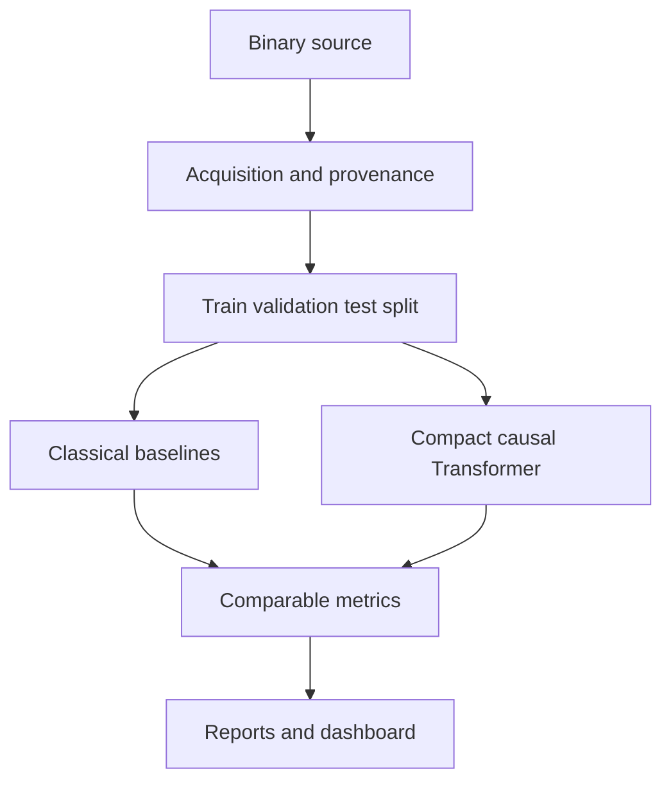

# RandomnessTransformerLab

Research prototype for **ML-Based Analysis of Classical and Quantum Random Number Generators**, aligned with Ericsson Master's Thesis Job ID 791176.

The project trains compact Transformer models from scratch to predict the next bit or block in binary sequences, then compares predictive performance with classical statistical, entropy, and compression-based indicators.

> **Important:** This is a research and educational prototype. Its tests are not a replacement for the official NIST Statistical Test Suite or a validated SP 800-90B entropy-assessment implementation. Cryptographic and quantum sources must be evaluated with approved tools and documented acquisition/preprocessing procedures.

## Included capabilities

- Binary sources: OS entropy, NumPy PRNG, Python Mersenne Twister, weak LCG, biased Bernoulli, first-order Markov, periodic sequence, Hash-DRBG-style and HMAC-DRBG-style research generators
- Raw `.bin`, ASCII `0/1`, NumPy `.npy`, CSV, and hexadecimal input loading
- Baselines: monobit frequency, block frequency, runs, serial-pair, lag autocorrelation, longest run, zlib compression, most-common-value min-entropy, and first-order Markov min-entropy
- Compact causal Transformer for next-bit and next-block prediction
- Reproducible train/validation/test splits and seeded experiments
- Metrics: accuracy, balanced accuracy, cross-entropy in bits, perplexity, Brier score, ROC-AUC for next-bit models, empirical entropy, predictive min-entropy proxy, latency, and parameter count
- Streamlit dashboard, command-line experiment runner, JSON/CSV artifacts, tests, Docker, and GitHub Actions

## Architecture



## Quick start

Requires Python 3.10+.

```bash
python -m venv .venv
# Windows: .venv\Scripts\activate
# macOS/Linux: source .venv/bin/activate
pip install -r requirements.txt
pytest -q
```

Run a short experiment:

```bash
python scripts/run_experiment.py \
  --source markov \
  --num-bits 100000 \
  --context-length 64 \
  --target-bits 1 \
  --epochs 4 \
  --output reports/markov
```

Compare sources without model training:

```bash
python scripts/compare_sources.py --num-bits 100000 --output reports/source_comparison.csv
```

Launch the dashboard:

```bash
streamlit run app.py
```

## Recommended thesis experiments

1. Establish classical baselines on controlled weak generators with known defects.
2. Train identical compact Transformers on each source using leakage-free contiguous splits.
3. Sweep context length, target block size, architecture size, sample count, and seed.
4. Compare prediction cross-entropy with compression and entropy estimates.
5. Evaluate calibration and statistical significance over repeated sequences.
6. Add official NIST 800-22 and 800-90B tool outputs as external columns rather than claiming this prototype is a compliant implementation.
7. Import QRNG data with full provenance and test preprocessing/formatting hypotheses before interpreting source differences.

## QRNG integration

Place authorized raw data outside Git, then run:

```bash
python scripts/run_experiment.py --input /secure/path/qrng.bin --format raw --output reports/qrng
```

Record device, acquisition time, bit ordering, whitening, framing, dropped bytes, and every transformation. Never infer a uniquely quantum signature from predictability differences alone.

## Repository structure

```text
randomness-transformer-lab/
├── randomness_lab/       Core library
├── scripts/              Experiment CLIs
├── tests/                Automated tests
├── configs/              Reproducible defaults
├── app.py                Streamlit dashboard
├── Dockerfile
└── README.md
```

## License

MIT. See `LICENSE`.
